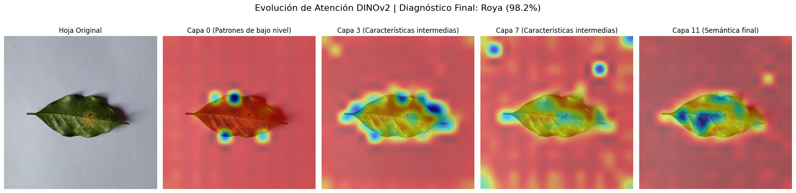

# Proyecto - Clasificador Fitosanitario para Hojas de Café

[Frontend / Demo del Proyecto](https://huggingface.co/spaces/YAFIS18/clasificador_enfermedades_cafe_fc)

## Documentación:

1. [Memoria Técnica](dev_model/MEMORIA-TECNICA.md)
2. [Documentación API](app/documentacion-api.md)

## Contexto

La caficultura es una actividad agrícola fundamental a nivel global, pero se enfrenta a constantes amenazas por diversas enfermedades fitosanitarias y plagas, tales como la roya y la araña roja. La detección temprana de estas afectaciones es crucial para evitar pérdidas masivas en las cosechas y aplicar tratamientos focalizados. Sin embargo, la identificación visual de las lesiones en las hojas requiere experiencia agronómica especializada.

En este proyecto, se implementan y comparan arquitecturas avanzadas de aprendizaje profundo —específicamente una **red neuronal convolucional (ResNet-18)** y un modelo de **Vision Transformer (DINOv2)**— para la clasificación automática de enfermedades en imágenes de hojas de café. Con el uso de estas herramientas de visión computacional, se busca lograr una alta precisión en el diagnóstico y proporcionar una herramienta de apoyo tecnológico para los productores agrícolas.

## Objetivo del Proyecto

El objetivo principal es desarrollar un sistema robusto para la clasificación de imágenes de hojas de café, identificando su estado de salud (sanas) o el tipo de enfermedad presente. Además, se busca dotar de explicabilidad a las predicciones de los modelos mediante la técnica de mapas de activación **Grad-CAM**, resaltando visualmente las lesiones y regiones específicas de la hoja que determinan el resultado de la red.

## Descripción General del Conjunto de Datos

El corpus utilizado para el entrenamiento y evaluación de los modelos en este estudio se denomina **Dataset_rocole_Maestro**. Este conjunto fue construido mediante la integración estratégica de dos fuentes de datos independientes para abordar una clasificación multiclase de cuatro categorías exclusivas.

### **Composición y Procesamiento del Dataset**
- **Fuente 1 (Coffee leaf dataset by phytosanitary clas):** Se extrajo una muestra perfectamente balanceada de 500 imágenes para cada una de las siguientes clases: **Sanas**, **Ojo de Gallo** y **Roya**.
- **Fuente 2 (RoCoLe: A Robusta Coffee Leaf Images Dataset):** Se seleccionaron exclusivamente las muestras correspondientes a la plaga de **Araña Roja**. A este grupo específico de imágenes se le aplicó un tratamiento topológico de segmentación utilizando el modelo fundacional **SAM-2** (Segment Anything Model 2) para eliminar el ruido ambiental y aislar únicamente el tejido de la hoja. Se extrajeron 155 imágenes exactamente.

### **Partición de Datos**
Para garantizar una evaluación estadística imparcial y una estricta reproducibilidad, se aplicó una semilla (`seed = 42`) para particionar el corpus maestro consolidado en una proporción de **70/10/20**, resultando en tres subconjuntos completamente disjuntos:
- **Entrenamiento:** 1,158 muestras.
- **Validación:** 166 muestras.
- **Pruebas:** 331 muestras.

## Análisis Exploratorio y Limitaciones (Shortcut Learning)

El análisis exploratorio cualitativo y la evaluación del modelo evidenciaron un marcado fenómeno de **aprendizaje de atajos** (*shortcut learning*). 

Se detectó que el modelo correlacionó la ausencia de fondo natural —una consecuencia exclusiva del procesamiento de segmentación con SAM-2 aplicado únicamente a las imágenes de Araña Roja— con la etiqueta de dicha plaga. La red neuronal demostró una alta sensibilidad a la luminancia extrema del entorno, aprendiendo a asociar los fondos blancos artificiales con la categoría de Araña Roja en lugar de extraer y priorizar las características morfológicas o patológicas reales del tejido foliar. 

Este hallazgo subraya la importancia de mantener una homogeneidad en el preprocesamiento de imágenes al integrar múltiples fuentes de datos para modelos de visión computacional en agricultura.

Este conjunto de datos permite que el modelo aprenda a identificar desde lesiones microscópicas iniciales hasta el daño estructural severo en el follaje del cultivo.

## Enlaces Relevantes

- [Base de Datos RoCoLe (Mendeley Data)](https://data.mendeley.com/datasets/c5yvn32dzg/2)
- [Documentación DINOv2](https://github.com/facebookresearch/dinov2)
