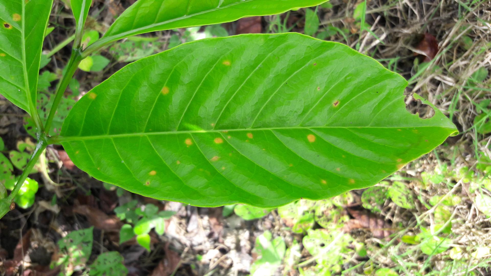
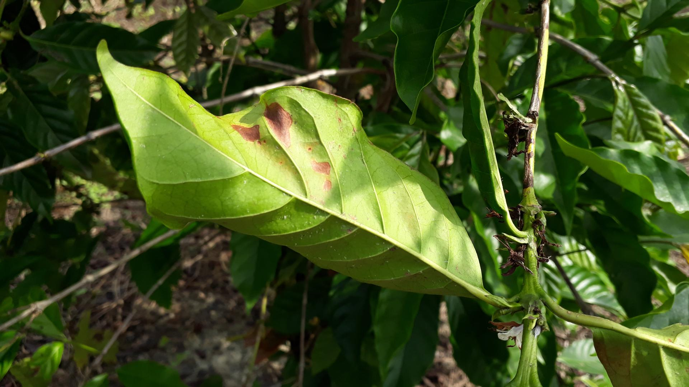
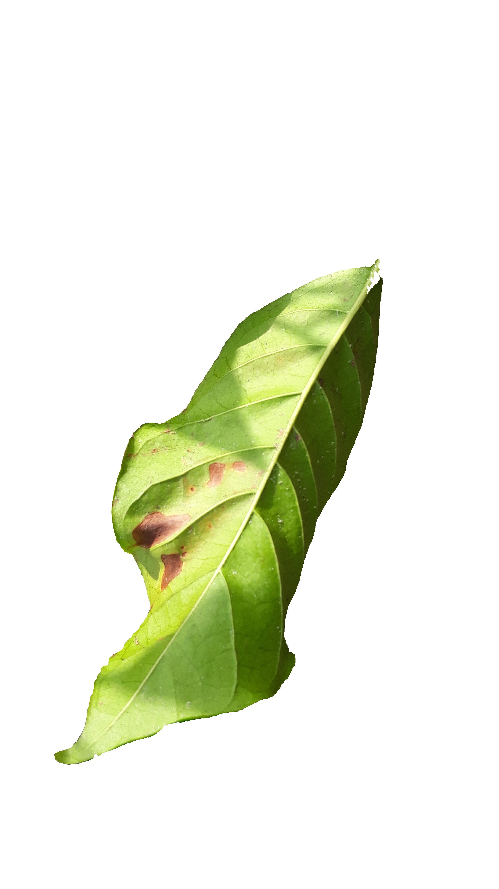
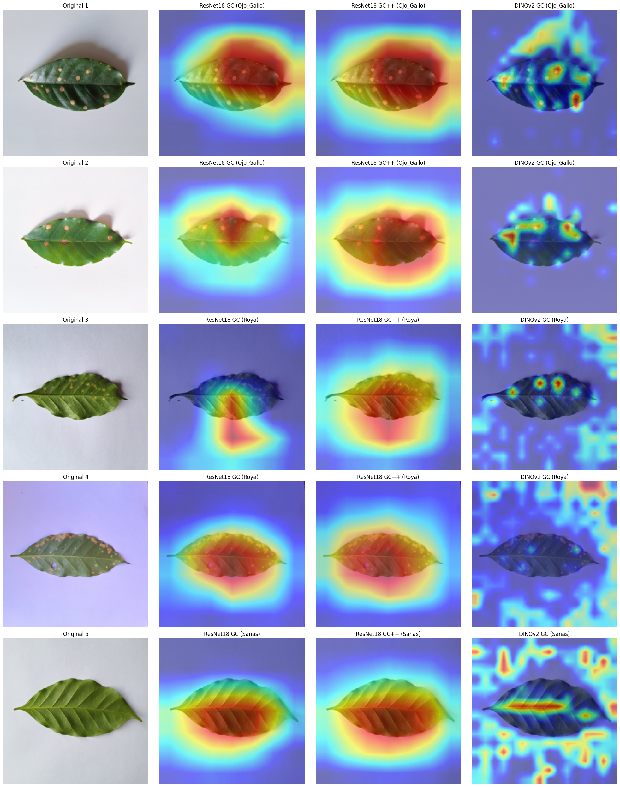
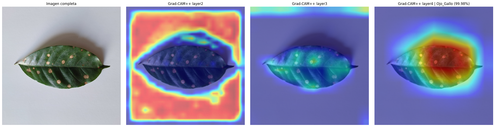

# Proyecto - Clasificador Fitosanitario para Hojas de Café

[Frontend / Demo del Proyecto](https://huggingface.co/spaces/YAFIS18/clasificador_enfermedades_cafe_fc)

## Documentación:

1. [Memoria Técnica](dev_model/MEMORIA-TECNICA.md)
2. [Documentación API](utils/documentacion-api.md)

## Contexto

El café es un pilar agrícola y económico fundamental. En México, el 11º productor mundial impulsado por estados como Chiapas, Veracruz y Puebla, este cultivo es vital para el sector 
agroindustrial. Sin embargo, su rentabilidad está constantemente amenazada por plagas y enfermedades de rápida propagación —como la Roya, la Araña roja, el Ojo de Gallo, la Mancha de Hierro y el Minador de la hoja—, las cuales son capaces de devastar plantaciones enteras en cuestión de semanas y causar severas pérdidas económicas a los agricultores.

En este proyecto, se implementan y comparan dos arquitecturas para la clasificación automática de enfermedades en imágenes de hojas de café. La **CNN ResNet-18** y un modelo de **Vision 
Transformer DINOv2**. Con el uso de estas herramientas de visión computacion, se busca lograr una alta precisión en el diagnóstico y proporcionar una herramienta de apoyo tecnológico 
para los productores agrícolas.

## Objetivo del Proyecto

Los objetivos de este trabajo se centran en identificar patrones sutiles de enfermedad (como el daño por ácaros u hongos) de forma robusta frente a fondos complejos y variaciones de luz, 
logrando superar el 92% de precisión sobre datos no vistos. Además, se busca aplicar técnicas de interpretabilidad para comprender visualmente en qué áreas de la imagen se basa el modelo 
para tomar sus decisiones. Finalmente, el proyecto pretende desplegar este sistema en dispositivos móviles, brindando a los agricultores una herramienta para optimizar el uso de pesticidas 
y mitigar sus pérdidas económicas.

## Descripción General del Conjunto de Datos

El conjunto de datos con el que se trabajó de manera general, se denominó  **Dataset_rocole_Maestro**. El Dataset fue construido mediante la combinación de dos fuentes de datos distintas
para abordar una clasificación multiclase de cuatro categorías exclusivas.

### **Composición y Procesamiento del Dataset**
- **Fuente 1 (Coffee leaf dataset by phytosanitary class):** Se extrajo una muestra perfectamente balanceada de 500 imágenes para cada una de las siguientes clases: **Sanas**, **Ojo de
Gallo** y **Roya**. Las imágenes contenidas se ve de la siguiente manera:

- **Fuente 2 (RoCoLe: A Robusta Coffee Leaf Images Dataset):** Se seleccionaron exclusivamente las muestras correspondientes a la plaga de **Araña Roja** . Se extrajeron 155 imágenes
exactamente. Además, comparándolo con el primer Dataset, estas imágenes fueron tomadas directamente en los cafetales y por lo tanto, contienen
variaciones de iluminación y estan acompañadas de más hojas y granos de café. A continuación un ejemplo:

Dada la naturaleza del contenido a este grupo de imágenes se le aplicó segmentación con el modelo SAM-2 (Segment Anything Model 2) para eliminar el fondo y aislar únicamente la hoja:
<table>
  <tr>
    <td align="center"><b>Imagen Original</b></td>
    <td align="center"><b>Segmentación con SAM-2</b></td>
  </tr>
  <tr>
    <td></td>
    <td></td>
  </tr>
</table>

## **Partición de Datos**
Para garantizar una evaluación estadística imparcial y una estricta reproducibilidad, se aplicó una semilla (`seed = 42`) para particionar el Dataset consolidado en una proporción de **70/10/20**, resultando en tres subconjuntos completamente disjuntos:
- **Entrenamiento:** 1,158 muestras.
- **Validación:** 166 muestras.
- **Pruebas:** 331 muestras.

## **ResNet18 (CNN)**
En cuanto a su arquitectura adaptada para este proyecto, la capa original diseñada para clasificar 1000 categorías fue reemplazada por un clasificador lineal de 
512 características de entrada y 4 salidas. Con esto, de los 11, 178, 564 parámetros totales de la red, únicamente 2, 052 (el 0.02 %) se mantuvieron entrenables.

dev_mode/ResNet18_DataAugmentation.ipynb

## DINOv2 (ViT)
DINOv2 (desarrollado por Meta) es un modelo fundacional de visión computacional de código abierto basado en la arquitectura Vision Transformer (ViT).
Para este proyecto se usó la variante ViT-S/14 (Vision Transformer - Small / Patch 14).
dev_model/DINOv2.ipynb

## Comparación de resultado 

| Modelo | Exactitud (%) | F1-Score | Parámetros |
| :--- | :---: | :---: | :---: |
| ResNet-18 | 96.98 | 0.97 | 11.17M (2,052 entrenables) |
| DINOv2 (ViT-S/14) | **99.4 ± 0.0** | **0.99** | ≈ 21M |

## Grad-CAM / Grad-CAM / Attention Rollout
- Grad-CAM: Analiza matemáticamente los gradientes (las derivadas) de la última capa de la red justo antes de que dé el resultado. Busca qué "filtros" se
encendieron con más fuerza al detectar, por ejemplo, la Roya. Genera un mapa de calor que suele ser un poco "borroso" o general. Te indica el área gruesa donde está la enfermedad, pero no dibuja bordes perfectos.
- Grad-CAM++: Es una mejora matemática directa del Grad-CAM original. En lugar de usar solo las derivadas de primer orden, incluye derivadas de segundo y tercer orden. Esto resuelve un problema clásico: cuando hay múltiples manchas de una enfermedad en la misma hoja, el Grad-CAM normal tiende a fusionarlas en un solo borrón gigante o a ignorar algunas. Grad-CAM++ logra iluminar múltiples zonas separadas con mucha más claridad y precisión.
- Attention Rollout: Dado que los Transformers no usan filtros convolucionales, Grad-CAM no funciona bien aquí. Estas redes usan mecanismos de "Auto-Atención" (cuadritos de 14x14 píxeles que se comunican entre sí). La técnica de Rollout rastrea cómo fluye esa información conectando la atención de los cuadritos capa por capa, desde la entrada hasta la predicción final. El resultado es un mapa de calor extremadamente nítido que a menudo logra dibujar la silueta exacta del daño celular de la Araña Roja sin iluminar el tejido sano alrededor.

Los resultados usando Grad-CAM en ResNet18 y DINOv2 además de Grad-CAM++ en la última capa de ambos modelos se muestran a continuación. Es un lote de 5 batches:

Ya que los resultados no fueron satisfactorios, se decidió usar Grad-CAM++ en ResNet 18 pero revisando sus diferente capas:

Como DINOv2 es un ViT, la mejor maner de ver el mapa de calor fue usando Attention Rollout:

## App

Finalmente La arquitectura DINOv2 fue exportada al estándar ONNX, convirtiéndola en un grafo estático. Esto reduce el tamaño del archivo, minimiza la latencia de 
inferencia y prepara el sistema para futuras optimizaciones computacionales.

Microservicio y Backend: El sistema fue contenerizado con Docker y expuesto como una API RESTful mediante FastAPI, procesando tensores de entrada con 
normalización estandarizada y dimensiones exactas ($1 \times 3 \times 224 \times 224$).

Filtro Out-of-Distribution (OOD): Evalúa la salida Softmax y rechaza automáticamente la inferencia si la confianza es inferior a 0.45, previniendo falsos positivos con imágenes ajenas al dominio agrícola.

Detección de Data Drift: Un sistema de telemetría calcula la media móvil de las últimas 10 predicciones. Si esta cae por debajo de 0.75, la API emite una alerta de degradación preventiva.

Interfaz de Usuario (Frontend): Desarrollada con Gradio. Aplica un preprocesamiento de upscaling mediante interpolación Lanczos (escalando a 3026 × 3026 píxeles) para maximizar la calidad visual antes de comunicarse de manera asíncrona con la API y mostrar los resultados en tiempo real.

## Análisis Exploratorio y Limitaciones (Shortcut Learning)

El análisis exploratorio y la evaluación del modelo evidenciaron un marcado fenómeno de **aprendizaje de atajos** (*shortcut learning*). 

Se detectó que el modelo correlacionó la ausencia de fondo natural ( consecuencia exclusiva del procesamiento de segmentación con SAM-2 aplicado únicamente a las imágenes de Araña Roja) con la etiqueta de dicha plaga. La red neuronal demostró una alta sensibilidad a la luminancia extrema del entorno, aprendiendo a asociar los fondos blancos artificiales con la categoría de Araña Roja en lugar de extraer y priorizar las características morfológicas o patológicas reales del tejido foliar. 

Este hallazgo subraya la importancia de mantener una homogeneidad en el preprocesamiento de imágenes al integrar múltiples fuentes de datos para modelos de visión computacional en agricultura.

## Enlaces Relevantes

- [Base de Datos RoCoLe (Mendeley Data)](https://data.mendeley.com/datasets/c5yvn32dzg/2)
- [Documentación DINOv2](https://github.com/facebookresearch/dinov2)
- [App](https://huggingface.co/spaces/YAFIS18/clasificador_enfermedades_cafe_fc) 
