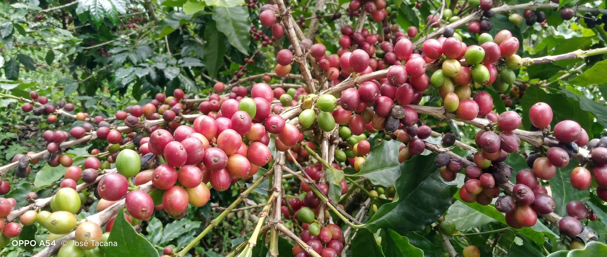

# Memoria Técnica

## Descripción de los Notebooks

Este repositorio contiene notebooks clave que abordan el análisis fitosanitario de las hojas de café desde la ingeniería de datos hasta el modelado de vanguardia:

### 📝 `EDA.ipynb`
Este notebook se enfoca en la construcción, limpieza y análisis del **Dataset_rocole_Maestro**. Se documenta el proceso de ingeniería de datos, proporcionando información sobre:
- Integración de fuentes independientes (dataset peruano y RoCoLe original).
- Balanceo de clases (Sanas, Ojo de Gallo, Roya y Araña Roja) y partición de datos (70/10/20) mediante semilla de reproducibilidad (`seed = 42`).
- Aplicación de segmentación topológica utilizando el modelo fundacional **SAM-2**.
- Análisis exploratorio de datos (EDA), identificando métricas clave y documentando cualitativamente el fenómeno de **aprendizaje de atajos (shortcut learning)** asociado a los fondos segmentados.

El objetivo es establecer un corpus de datos estructurado y auditable, comprendiendo a fondo los sesgos ambientales y morfológicos antes de la fase de modelado.

### 📝 `ResNet18_DataAugmentation.ipynb`
Este script detalla la implementación de una **Red Neuronal Convolucional (ResNet-18)** para la clasificación multiclase, optimizada con técnicas de enriquecimiento de datos.
- **Data Augmentation Balanceado:** Se generaron variaciones sintéticas de las imágenes hasta alcanzar exactamente **2,000 muestras por categoría**, asegurando un entrenamiento sin desequilibrio de clases.
- **Aislamiento de Entrenamiento:** Las transformaciones se aplicaron **exclusivamente al conjunto de entrenamiento**. Los datos de validación y prueba se mantuvieron en su estado original para evitar la
  filtración de información (*data leakage*) y medir el rendimiento real.
- **Entrenamiento Corto (10 Épocas):** El ciclo de aprendizaje se limitó a **10 épocas**. Gracias al alto volumen de datos generados por el aumento, el modelo logró una convergencia rápida, minimizando eficazmente el riesgo de sobreajuste (*overfitting*).
Este enfoque permite la automatización del diagnóstico agrícola, ofreciendo una herramienta tecnológica robusta para asistir a los productores y especialistas en el monitoreo de los cultivos.

### 📝 `DINOv2.ipynb`
Este script documenta la adaptación y ajuste fino (*fine-tuning*) del modelo fundacional **Vision Transformer (DINOv2)** para la clasificación de las afectaciones en las hojas.
-   **Entrenamiento Optimizado:** El ciclo de aprendizaje se configuró para un máximo de **40 épocas**, permitiendo al modelo aprender patrones complejos a través de sus mecanismos de auto-atención.
-   **Prevención de Sobreajuste (Early Stopping):** Se implementó un mecanismo de parada temprana con una paciencia de **5 épocas**. Esto detiene automáticamente el entrenamiento si la métrica de validación deja de mejorar, ahorrando recursos computacionales y garantizando que se guardan los pesos óptimos de la red.

### 📝 'Grad_CAM,ipynb'
Para comprender el proceso de toma de decisiones de los modelos y garantizar que el aprendizaje se basara en características fitopatológicas reales (y no en atajos visuales), se implementó un análisis profundo de explicabilidad extrayendo mapas de calor desde múltiples profundidades de las arquitecturas:
-  **ResNet-18 (Grad-CAM y Grad-CAM++):** Se aplicaron ambas técnicas de mapas de activación espacial a través de diferentes capas convolucionales. El uso complementario de Grad-CAM++ permitió una mejor localización de múltiples lesiones simultáneas en la misma hoja. Analizar distintas capas reveló cómo la red refina su enfoque: desde bordes genéricos en las etapas iniciales, hasta centrarse exclusivamente en la morfología de la enfermedad en las capas más profundas.
-   **DINOv2 (Grad-CAM y Attention Rollout):** Inicialmente se evaluó el comportamiento del *Vision Transformer* utilizando Grad-CAM. Sin embargo, debido a la arquitectura basada en parches (*patches*) de ViT, esta técnica resultó insuficiente y poco precisa. Para resolverlo, se implementó **Attention Rollout** a lo largo de las distintas capas y cabezales de auto-atención (*self-attention heads*). Este método logró mapear de forma exacta y coherente cómo el modelo integra el contexto global de la hoja para emitir su diagnóstico.

🚀 **Ambos notebooks complementan el estudio de enfermedades fitosanitarias desde un enfoque de ciencia de datos e inteligencia artificial, proporcionando información valiosa para la agricultura de precisión.**
